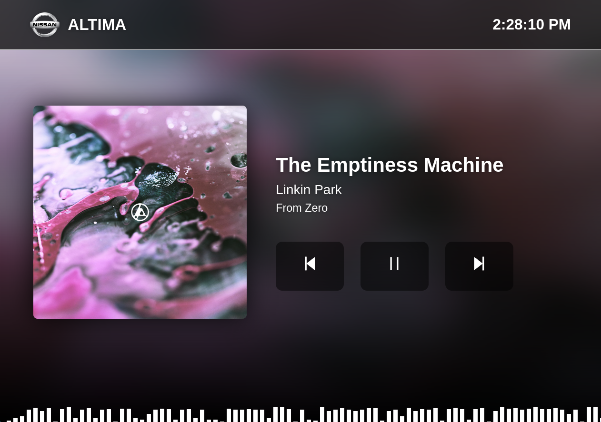

# ADB Media Player (React Car Media Player)
A simple media player for Android using ADB, React and Neutralinojs.




Prepare environment:
```bash
cd ui
bun install
```
Run the app:
```bash
neu run -- --mode=browser 
```
This project aims to be integrated with Raspberry Pi and a car display. The idea is to have a
simple media player that can be controlled by the car's steering wheel buttons (there are plans to
use in built stereo touch screen as well).

Application can be tested by just running the app as specified above and having an Android device
connected to the computer that is already authorized for ADB.

# Commands to prepare Raspberry Pi
```bash
sudo apt update
sudo apt install -y adb omxplayer luajit nodejs
sudo plymouth-set-default-theme --rebuild-initrd pix
# TODO
# Add autostart files
# Mount services to start on boot
# Add configuration for raspi-config
```